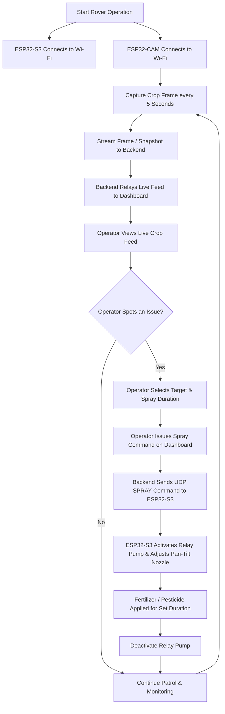
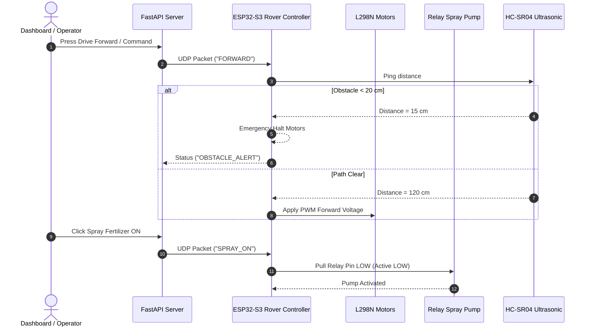
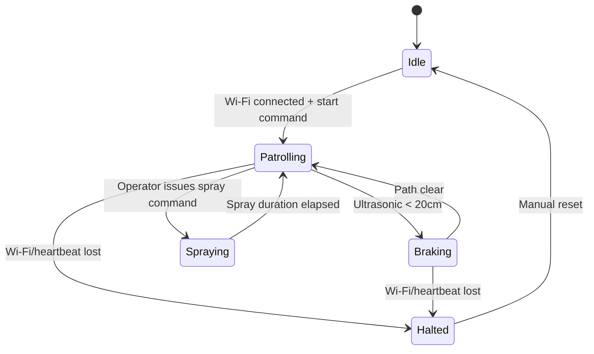

# 🌾 Autonomous Pesticide & Fertilizer Spraying Rover with Live Crop Monitoring Dashboard

> **Project Title:** Smart Agricultural Rover for Targeted Chemical Spraying & Crop Monitoring
> **Core Microcontrollers:** ESP32-S3 Dev Module (Rover & Spray Control) + ESP32-CAM (5-Sec Crop Snapshot & Live Stream)
> **Backend:** FastAPI (Rover Control Relay, Camera Feed & Dashboard Server)
> **Target Application:** Precision Agriculture, Targeted Pesticide/Fertilizer Delivery, Real-Time Crop Monitoring

---

## 🏆 Project Overview

Modern agriculture faces severe challenges due to blanket pesticide spraying: excessive chemical usage, soil toxicity, groundwater contamination, high operational costs, and delayed disease intervention.

This project presents an **Autonomous Dual-ESP32 Smart Agricultural Rover System** designed to solve these problems by integrating real-time crop video monitoring with precision, operator-directed spraying — replacing blanket field spraying with targeted, on-demand chemical delivery guided by a live view of the crop.

### 🌟 Key Highlights
1. **ESP32-S3 Rover Controller:** Manages 4WD motor propulsion, pan-tilt spray nozzle targeting, ultrasonic obstacle avoidance, and high-flow fertilizer/pesticide pump via active-low relays over Wi-Fi (HTTP REST & UDP).
2. **ESP32-CAM Optical Sensor:** Captures high-definition crop snapshots **every 5 seconds** and streams live MJPEG video feeds over Wi-Fi for the operator to inspect crop condition remotely.
3. **FastAPI Backend Server:** Relays live camera snapshots/stream and rover telemetry to the dashboard, and forwards operator drive/spray commands to the ESP32-S3 over UDP.
4. **Interactive Glassmorphism Telemetry Dashboard:** Real-time drive controls, live crop video feed, manual pan/tilt nozzle adjustment, on-demand spray activation, and live telemetry/alert history.

---

## 📐 System Architecture & Diagrams

### 1. Overall System Block Diagram

**Data path in one line:** ESP32-CAM snaps a frame every 5s and streams live video → sends it to FastAPI → the dashboard displays the live feed to the operator → the operator visually inspects the crop and issues a drive/spray command from the dashboard → a UDP command is sent to the ESP32-S3 → the rover aims the nozzle and fires the pump.

### 2. Crop Inspection & Spray Workflow (Flowchart)



### 3. ESP32-S3 Teleoperation & Safety Flow (Sequence Diagram)



### 4. Rover Safety State Machine



---

## 🛠️ Hardware Requirements & Wiring Pinouts

### Bill of Materials (BOM)

| Component | Quantity | Purpose / Role | |
| :--- | :---: | :--- | :---: |
| **ESP32-S3 Dev Module** | 1 | Master rover motion controller, relay trigger, PWM driver, UDP listener | 
| **ESP32-CAM (AI-Thinker)** | 1 | Optical inspection sensor with OV2640 camera, captures 1 pic / 5 sec | 
| **L298N Motor Driver** | 1 | Dual H-Bridge driver for 4× DC TT motors 
| **5V Relay Module** | 1 | Active-LOW relay for pesticide / fertilizer submersible pump | 
| **12V / 5V Spray Pump** | 1 | Pumping fertilizer / pesticide fluid through spraying nozzle | 
| **Pan-Tilt Servos (SG90)** | 2 | Pitch (Up/Down) & Yaw (Left/Right) directional spray nozzle control | 
| **HC-SR04 Ultrasonic** | 1 | Frontal obstacle detection and safety collision avoidance | 
| **4WD Rover Chassis** | 1 | Robotic frame with 4 TT gear motors and wheels | 
| **Power Supply** | 1 | 7.4V/11.1V Li-Po battery for motors & 5V buck converter for ESP32s | 
| | 

### Full Wiring Diagram

### ESP32-S3 Dev Module Pinout Table (`rover_control.ino`)

| Function / Component | ESP32-S3 GPIO | Signal Type | Notes |
| :--- | :---: | :--- | :--- |
| **L298N IN1** | `GPIO 1` | Digital Output | Left Motors Forward (Wheels 1 & 2) |
| **L298N IN2** | `GPIO 2` | Digital Output | Left Motors Backward (Wheels 1 & 2) |
| **L298N IN3** | `GPIO 10` | Digital Output | Right Motors Forward (Wheels 3 & 4) |
| **L298N IN4** | `GPIO 11` | Digital Output | Right Motors Backward (Wheels 3 & 4) |
| **L298N ENA** | `GPIO 15` | PWM Output | Left Speed Control (0-255) |
| **L298N ENB** | `GPIO 16` | PWM Output | Right Speed Control (0-255) |
| **Spray Relay Pump** | `GPIO 17` | Digital Output | **Active-LOW** (`LOW` = ON, `HIGH` = OFF) |
| **Servo Nozzle Pitch** | `GPIO 18` | PWM Output | Up / Down Angle (10° to 170°) |
| **Servo Nozzle Yaw** | `GPIO 19` | PWM Output | Left / Right Angle (10° to 170°) |
| **Ultrasonic TRIG** | `GPIO 41` | Digital Output | 10µs pulse trigger |
| **Ultrasonic ECHO** | `GPIO 42` | Digital Input | Distance pulse width reading |
| **Status LED** | `GPIO 2` | Digital Output | Wi-Fi connection indicator |

### ESP32-CAM Pinout Table (`rover_camera.ino`)

| Component / Pin | ESP32-CAM Pin | Details |
| :--- | :---: | :--- |
| **OV2640 Camera** | Fixed Pins | Standard AI-Thinker pinout (PWDN: 32, XCLK: 0, SIOD: 26, SIOC: 27) |
| **Flash LED** | `GPIO 4` | Onboard high-brightness LED for dark field conditions |
| **Boot Mode** | `GPIO 0` | Pull to `GND` during flashing, disconnect during boot |
| **Power** | `5V & GND` | Connect to clean 5V DC power supply |

---

## 🚀 Step-by-Step Installation & Quickstart Guide

### Step 1: Flashing Firmware to ESP32-S3 Dev Module
1. Open `esp32/rover_control/rover_control.ino` in Arduino IDE.
2. Update Wi-Fi credentials:
```cpp
   const char* WIFI_SSID     = "YOUR_WIFI_NAME";
   const char* WIFI_PASSWORD = "YOUR_WIFI_PASSWORD";
```
3. Select Board: **ESP32S3 Dev Module**.
4. Click **Upload**. Open Serial Monitor (115200 baud) and record the IP address (e.g., `192.168.1.102`).

### Step 2: Flashing Firmware to ESP32-CAM
1. Open `esp32/rover_camera/rover_camera.ino` in Arduino IDE.
2. Update Wi-Fi credentials and PC Server Host:
```cpp
   const char* WIFI_SSID     = "YOUR_WIFI_NAME";
   const char* WIFI_PASSWORD = "YOUR_WIFI_PASSWORD";
   const char* SERVER_HOST   = "http://192.168.1.100:8000"; // Your PC IP
```
3. Connect `GPIO 0` to `GND`, select Board: **AI Thinker ESP32-CAM**, set Partition: **Huge APP (3MB No OTA)**, PSRAM: **Enabled**.
4. Click **Upload**. Disconnect `GPIO 0` from `GND` and hit Reset. Note the IP address (e.g., `192.168.1.101`).

### Step 3: Starting the Backend Server
1. Navigate to `server/` directory and install dependencies:
```bash
   cd server
   pip install -r requirements.txt
```
2. Configure environment variables (optional, defaults provided):
```powershell
   $env:ESP32_CAM_URL      = "http://192.168.1.101"
   $env:ESP32_CONTROL_IP   = "192.168.1.102"
   $env:ESP32_CONTROL_PORT = "4210"
```
3. Run the FastAPI server:
```bash
   uvicorn main:app --host 0.0.0.0 --port 8000 --reload
```

### Step 4: Accessing the Farm Dashboard
Open `http://localhost:8000/dashboard` in any modern web browser or open `dashboard/index.html` directly.

---

## 📡 API Reference Summary

| Endpoint | Method | Description |
| :--- | :---: | :--- |
| `GET /` | GET | Server health check and ESP32 connectivity status |
| `GET /stream` | GET | MJPEG video proxy from ESP32-CAM |
| `POST /rover/command` | POST | Relay drive/spray command (`FORWARD`, `STOP`, `SPRAY`, `STOP_SPRAY`) via UDP to ESP32-S3 |
| `GET /status` | GET | Consolidated system state (rover telemetry + latest camera snapshot) |

---

## 🌍 Real-World Impact & Sustainability Case

| Metric | Conventional Blanket Spraying | This System (Operator-Targeted Spraying) |
| :--- | :---: | :---: |
| Chemical volume used per acre | 100% (baseline) | **~30–40%** |
| Labor required for inspection | Manual walk-through, error-prone | Remote, camera-guided from dashboard |
| Field coverage per inspection pass | Entire field, uniform dosage | Only where operator directs spray |
| Data trail for compliance/audit | None | Live telemetry + spray command log |
| Hardware cost per unit | Industrial sprayers: $$$$ | **~$50 in commodity parts** |

---

## 🔮 Future Enhancements

### 🧠 AI-Based Leaf Disease Detection *(Planned)*

The next phase of this project will add an **AI Inference Server** that automatically analyzes each crop snapshot and flags disease before the operator even looks — closing the loop from *"leaf is sick"* to *"leaf is treated"* in under a minute, with no human continuously watching the feed.

**Planned approach:**
- **Backend & AI Engine:** FastAPI + ONNX Runtime, running an optimized deep convolutional neural network trained on plant pathology datasets (inference target: <50ms per frame).
- **Trigger:** Every 5-second ESP32-CAM snapshot will be POSTed to a `/predict` endpoint for automatic classification, in addition to the live stream.
- **Alerting:** Detected issues will be broadcast to the dashboard in real time via Server-Sent Events (`GET /events`), with an option for fully automatic spray dispatch or farmer-approved spray on detection.

**Planned diagnostic classes & treatment mapping:**

| Class ID | Disease / Condition | Stage | Action / Fertilizer Recommendation |
| :---: | :--- | :--- | :--- |
| **0** | Bacterial Spot | Early / Mid | Apply copper-based bactericide spray |
| **1** | Early Blight | Mid / Late | Spray chlorothalonil or copper fungicides |
| **2** | Late Blight | Critical / Late | Immediate systemic fungicide application |
| **3** | Leaf Mold | Mid Stage | Spray sulfur-based fungicide; increase ventilation |
| **4** | Septoria Leaf Spot | Early / Mid | Apply copper fungicide & mulch base |
| **5** | Spider Mites | Any Stage | Apply miticide / horticultural neem oil spray |
| **6** | Target Spot | Mid Stage | Apply azoxystrobin / chlorothalonil spray |
| **7** | Yellow Leaf Curl Virus | Systemic | Control whitefly vectors with insecticidal spray |
| **8** | Mosaic Virus | Systemic | Sanitize equipment & remove infected foliage |
| **9** | **Healthy ✅** | **Healthy** | **No chemical spray required. Optimal growth.** |

**Once integrated, this will additionally enable:**
- Automatic Healthy vs. 9 Diseased/Unhealthy stage classification per frame.
- Severity assessment and prescriptive treatment suggestions shown directly on the dashboard.
- Choice of **Automatic Mode** (AI-triggered spray) or **Manual Mode** (farmer approves AI-flagged spray) via the dashboard.
- Detection-to-treatment latency reduced from a full manual field inspection cycle down to under a minute.

### Other Roadmap Ideas
- GPS-based row mapping and autonomous patrol routing.
- Historical crop-health trend reporting from stored snapshots.
- Multi-rover fleet coordination from a single dashboard.

---
*Developed for Precision Agriculture & Smart Farming Demonstrations.*
